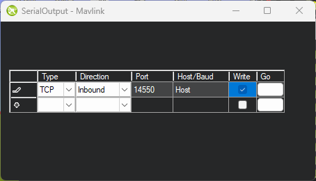

# Installation Steps

### 1. Use the Microsoft store to install "Python Install Manager":

Use the link: https://apps.microsoft.com/detail/9NQ7512CXL7T

### 2. Install Python 3.13

Firstly open "Windows PowerShell" on your computer. This is a Command Line Interface (CLI) and will
open a window with a command prompt. The first commanded needed is the command to install a specific
version of Python. Type the command below into the PowerShell window and press the enter key to run
the command.

```
py install 3.13
```

This should install Python 3.13. You can check that your Python installation works by typing the command:
```ps1
python --version
```

This should result in otuptu similar to below. The last digit may differ if there have been updates
to Python.
```
Python 3.13.9
```

> NB: Python 3.14 is available, but the `pymavlink` package does not yet have pre-built packages for
> Windows so for now use Python 3.13

### 3. Create a virtual environment for the project

Following [Python recommendations](https://docs.python.org/3/using/windows.html#using-python-on-windows),
a virtual environment should be created for each project.

First, use `cd` to go to your local user directory:
```ps1
cd C:\Users\$Env:UserName
```

Then create a virtual environment for the project:
```ps1
python -m venv PymavlinkDemo
```

Then use `cd` again to go to the project directory:
```ps1
cd PymavlinkDemo
```

Finally activate the virtual environment
```ps1
Scripts\Activate
```

Your command prompt should now have the name of the activated environment at the start:
```console
(PymavlinkDemo) PS C:\Users\USERNAME\PymavlinkDemo>
```

### 4. Install `pymavlink`

Using `pip`, install `pymavlink`:

```ps1
python -m pip install pymavlink
```

`pip` should download the packages and any of their requirements and install them.

To check the `pymavlink` installation, you can try to import it in Python. First
launch Python by running it in PowerShell:
```ps1
python
```

By default, Python will open up in interactive mode, where you can type Python code and
have it run instantly. This is very useful for testing things out.

To test the pymavlink installation, we will enter an import statement at the Python prompt:

```console
>>> import pymavlink
```

To exit the Python prompt, either press `Ctrl-d` or type `exit()` and press enter.

### 5. Optional: Install VSCode

VSCode is a free editor from Microsoft that is available on multiple platforms. It can be downloaded from
[code.visualstudio.com](https://code.visualstudio.com/) It has support for Python syntax highlighting and
autocomplete by default. Extensions can be added to make it more powerful.

# Setting up the simulator

### 1. Install MissionPlanner

MissionPlanner installation instructions can be found here:
https://ardupilot.org/planner/docs/mission-planner-installation.html


### 2. Open MissionPlanner and launch the simulation

With MissionPlanner open, choose the "Simulation" screen from the icons at the top. We will set the
simulation to start at the university's flying site, Fenswood Farm by adding the following to the "Extra
command line" field:

```txt
--home=51.4234178,-2.6715506,50,155
```

This sets up the vehicle at Fenswood Farm, pointing out into the field. Following the `home` option are the
latitude and longitude, in degrees north and east respectively; the altitude in metres above mean sea level; and
finally an initial heading in degrees. As Bristol is west of the Prime Meridian, the longitude value is negative.


Then click on the Multirotor icon at the bottom of the screen to start the simulator.

### 3. Setup MAVLink output from MissionPlanner

The simulator should now be running, but to be able to connect to it from Pymavlink, we need to tell
MissionPlanner to mirror it's received MAVLink stream.

Firstly, from the main MissionPlanner screen, press `Ctrl+f` A window appears with additional options:


Click "Mavlink" from first column (highlighted in red above). This opens a small window which may look
like the screenshot below. If it does not look like this, skip to the Alternate Serial Output Dialog
section below.


In this window, choose 'TCP Host - 14550' from the first box. This will setup MissionPlanner to
act as a TCP server. Our script will then act as a TCP client and connect to this server to receive
the MAVLink stream.

"Write access" needs to be checked. This tells Mission Planner to allow data to be written from the
connected script back up to the simulated vehicle.

Nothing is needed for the other box in this window.

Click "Connect" and a final window will appear:


Here you can set the port for the TCP server to listen on. For now, we'll leave it at `14550` and click "OK".
Once that's done you the `Ctrl+f` window.

#### Alternate Serial Output Dialog

In some versions of MissionPlanner, a different Serial Output dialog is used:



Set the options in the dialog to the same as those in the screenshot, then press the button in the "Go" column
for the row you have just set up. The button should change to contain the text "Started". Once that's done you
can close the Serial Output dialog and the `Ctrl+f` window.

### 4. Test our connection is working

Back in PowerShell, type `python` to launch the standard Python prompt. Here you can type in lines of Python code to
be executed immediately. We will type a few lines to test our connection:

```python
>>> from pymavlink import mavutil
>>> master = mavutil.mavlink_connection("tcp:127.0.0.1:14550")
>>> master.recv_msg()
```

You should see that a message object has been received. The exact type will differ depending on the most recently received message.


You can also print the message to see its contents:


# Troubleshooting

### PowerShell complains that environment cannot be loaded

If you get an error message like below that the environment cannot be activated, you may need to
adjust the PowerShell execution policy.

```ps1
.\Scripts\activate : File C:\Users\aa12345\PymavlinkDemo\Scripts\Activate.ps1 cannot be loaded because running scripts is disabled on this system. For more information, see about_Execution_Policies at
https:/go.microsoft.com/fwlink/?LinkID=135170.
At line:1 char:1
+ .\Scripts\activate
+ ~~~~~~~~~~~~~~~~~~
    + CategoryInfo          : SecurityError: (:) [], PSSecurityException
    + FullyQualifiedErrorId : UnauthorizedAccess
```

To allow the `Activate` script to run, run the command:

```ps1
Set-ExecutionPolicy -ExecutionPolicy RemoteSigned -Scope CurrentUser
```

This allows locally written scripts to be run by PowerShell.

### Vehicle does not arm

If you run your script too quickly after starting the simulator, the vehicle may fail to arm. This may be because the vehicle is
still in the process of initialising.

`PreArm: Need Position Estimate` is a typical warning. It means that the Extended Kalman Filter (EKF) has not been running for
long enough to have fused all the data it needs for a stable position estimate.


You can view messages from the vehicle using the "Messages" tab in MissionPlanner. Waiting until you see the `EKF3 IMU1 is using
GPS` message ensures that the EKF has generated a stable position estimate. You could add to the script to check if the arming was
successful and try again following a failure.


