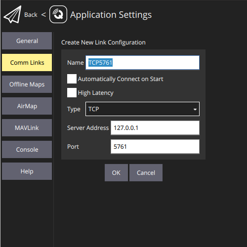

# Running the simulator on macOS

> NB: These instructions are not well tested, if you come across a problem, add an issue to
>  this repository.

> NB: These instructions assume you are on an ARM Mac, i.e one with an Apple Mx chip.

Mission Planner is not available for macOS directly, but a the simulator can be run directly, then
QGroundControl can be used as the GCS software.

# Installation

## QGroundControl

QGroundControl (QGC) can be downloaded from this page:
https://docs.qgroundcontrol.com/master/en/qgc-user-guide/getting_started/download_and_install.html

## Software-In-The-Loop (SITL) Simulator

A piece of software called Docker can be used to run the simulator. Docker can be downloaded for macOS
from here:
https://docs.docker.com/desktop/setup/install/mac-install/

Once you have downloaded Docker, open the application to finsh the install process.

Once you have Docker installed, open a Terminal window and run this command:
```console
docker run -p 5761:5761 -p 14550:14550 -it orthuk/ardupilot-sitl ./Tools/autotest/sim_vehicle.py -v ArduCopter --frame quad --mavproxy-args '--out tcpin:0.0.0.0:5761 --out tcpin:0.0.0.0:14550' -l 51.4234178,-2.6715506,50,155
```

The first time this runs, it will take a long time to download the simulator. Subsequent runs
should be much quicker.

## Connecting QGroundControl

Once the simulator is running, you should then be able to start up QGroundControl and connect to the
simulator. If it doesn't connect automatically, you will need to set it up to connect to
TCP:127.0.0.1:5761. See the section below

> NB: The first time you open QGC, there will be some initial setup screens about measurement units
> and vehicle information. Change these if you want. Setting the vehicle to MultiRotor is a good idea
> initially.

### Connecting QGroundControl to the simulator

The first stage is to set up the connection to use:
- Click the "Q" icon in the top-left of the window
- Click "Application Settings"
- Click "Comm Links" on the left
- Click "Add" at the bottom of the screen
- Setup the new connection as in the screenshot below
- Click "OK" to save the connection



With the connection set up, use it to connect to the simulator:
- Navigate to the "Comm Links" screen (Q-icon, Application Setting, Comm Links)
- Click the new "TCP5761" connection to select it
- Click "Connect" next to the newly-added connection

Clicking the paper plane icon at the top-left of the screen should get you back to the map view.

## Installing Python

macOS might already have Python installed. Run `python3 --version` in a Terminal window
to check. The exact version does not matter too much.

If it is not installed, follow the instructions here to install Python:

https://docs.python-guide.org/starting/install3/osx/


## Creating a virtual environment for the project

There are a few differences in setting up the virtual environment on macOS:

You should not need to change directory (`cd`) on macOS, you should already be in your local user (home) directory.


Creating the virtual environment should work the same way as on Windows:
```console
python3 -m venv PymavlinkDemo
```

Then, just like on Windows, use `cd` to go into the project directory:
```console
cd PymavlinkDemo
```

Activating the virtual environment is a little different:
```console
source bin/activate
```

Again your command prompt should now have the name of the activated environment at the start.

## Installing `pymavlink`

The installation of `pymavlink` should be the same as on Windows, be sure to use `python3`:

```console
python3 -m pip install pymavlink
```

You can check if the installation worked the same way as Windows, again using `python3`

## Running the example scripts

The example scripts should work by default as they try to connect to port 14550. Be sure to
'activate' your virtual environment and run them with `python3`


# Extra details

## Explaining the simulator command

Docker is a piece of software that enables running containers. A container is effectively a small,
lightweight virtual machine that contains the software you want to run, along with all of its
dependencies. When running the simulator command, we are instructing Docker to run a container using
a specific image, and to run a specific command within that container. We also tell it to connect
some ports for us so we can communicate with the simulator.

Below the command has been split out and explanations added. Note that the `-l` option at the end of
the command is the same as the `--home` option provided to the "Extra command line" in
MissionPlanner.

```bash
docker run \                        # Tells Docker to run a container
  -p 5761:5761 -p 14550:14550 \     # Tells Docker to connect ports 5761 and 14550
  -it \                             # Tells Docker to run in "interactive" mode
  orthuk/ardupilot-sitl \           # Specified which image Docker should use
    ./Tools/autotest/sim_vehicle.py \  # This is the command to run inside the container
    -v ArduCopter \  # Tells the simulator we want the ArduCopter code
    --frame quad \   # Tells the simulator we want a quadcopter
    # The line below tells the simulator allow connections from ports 5761 and 14550
    --mavproxy-args '--out tcpin:0.0.0.0:5761 --out tcpin:0.0.0.0:14550' \
    -l 51.4234178,-2.6715506,50,155 # Sets the starting location for the simulator
```

More information about the `sim_vehicle.py` script that is being run in the container can be found
here:

https://ardupilot.org/dev/docs/using-sitl-for-ardupilot-testing.html

# Troubleshooting

# Cannot start the simulator

If Docker complains about ports still being open, it may be that an old copy of the simulator is still
running in the background. Check for it on the Docker dashboard (Click the Docker icon on the menubar).
Under containers, there should be a simulator container running which you can stop using the "stop"
button.

If that doesn't work, you can try using the command line to stop the container. Open a new Terminal window
and run `docker ps`. It should show that there is a container running. Copy the name of the container (last
column of the output) and run `docker kill CONTAINER_NAME` where `CONTAINER_NAME` is replaced with the name
of the container you copied.
